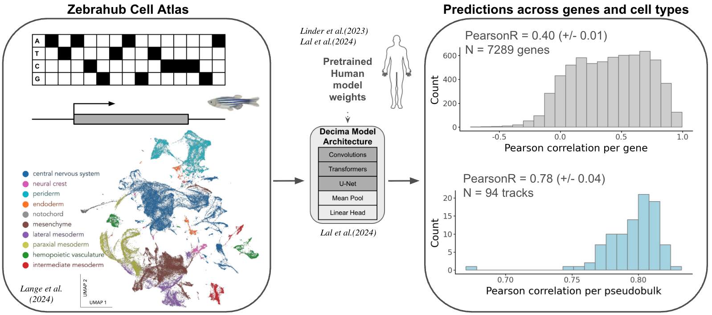

# DanioDecima Deep Learning Framework

A comprehensive deep learning framework for predicting single-cell RNA-seq expression from genomic DNA sequences in zebrafish development.

## Overview

DanioDecima extends the Borzoi architecture to predict cell-type-specific gene expression patterns across zebrafish developmental stages. The framework implements transfer learning from human and mouse models, enabling cross-species regulatory sequence analysis and synthetic regulatory element design.



## Key Features

- **Multi-species Transfer Learning**: Systematic comparison of human vs. mouse pretrained models for zebrafish expression prediction
- **Cell-Type Specificity**: Predictions across 85 cell-type × developmental timepoint combinations
- **Attribution Analysis**: Model interpretability through genomic feature attribution to assess conservation confounding
- **Regulatory Element Design**: Directed evolution pipeline for generating cell-type-specific synthetic promoters
- **Comprehensive Evaluation**: Statistical framework for model performance assessment across developmental stages

## Framework Architecture

### Model Specifications
- **Input**: 5-channel sequences (4 DNA bases + gene mask, 524,288bp windows)
- **Architecture**: 7 CNN blocks + 8 Transformer blocks (1,920 embedding channels)
- **Output**: Cell-type-specific expression predictions via exponential activation
- **Loss Function**: TaskWisePoissonMultinomialLoss (Poisson + multinomial components)

### Experimental Design
- **16 Model Configurations**: 4 initialization strategies × 4 replicates each
- **Initialization Types**: Random, Human-Borzoi, Human-Decima, Mouse-Borzoi pretraining
- **Training**: Early stopping, gradient accumulation, distributed GPU compute via SLURM

## Analytical Workflows

1. **Data Exploration**: Single-cell preprocessing, variance analysis, conservation metrics
2. **Model Training**: Distributed training pipeline with systematic experimental design
3. **Prediction Generation**: Scalable inference with sequence augmentation
4. **Performance Evaluation**: Cell-type-specific metrics and developmental stage analysis
5. **Attribution Analysis**: InputXGradient interpretability and conservation confounding assessment
6. **Regulatory Design**: Evolutionary optimization of synthetic regulatory elements

## Key Results

- **Transfer Learning Effectiveness**: Quantified performance gains from cross-species pretraining
- **Developmental Patterns**: Temporal prediction accuracy across zebrafish embryogenesis
- **Conservation Analysis**: Assessment of model reliance on evolutionary vs. regulatory signals
- **Synthetic Design**: Generated cell-type-specific promoter elements with motif analysis

## Repository Structure

```
decima-applications-main/notebooks/
├── 2_dataset/           # Data exploration and preprocessing
├── 4_evaluation/        # Model evaluation and performance analysis
├── 5_specificity/       # Attribution analysis pipeline
└── 9_design/           # Regulatory element design workflows

decima-main/scripts/
├── decima_finetune.py          # Model training
├── decima_predictions.py       # Prediction generation
└── submit_*.sh                 # SLURM job submission scripts
```

## Requirements

- PyTorch Lightning
- Captum (attribution analysis)
- scanpy (single-cell analysis)
- SLURM (distributed computing)
- GPU compute (H100/H200 recommended)

## Usage

### Model Training
```bash
sbatch decima-main/scripts/submit_decima_finetune.sh
```

### Generate Predictions
```bash
sbatch decima-applications-main/notebooks/4_evaluation/00_submit_predict_decima.sh
```

### Attribution Analysis
```bash
sbatch decima-applications-main/notebooks/5_specificity/00_submit_combined_attributions.sh
```

### Regulatory Element Design
```bash
sbatch decima-applications-main/notebooks/9_design/00_submit_evolve_combined.sh
```

## Citation

**Primary Framework:**
```bibtex
@article{lal2024decoding,
  title={Decoding sequence determinants of gene expression in diverse cellular and disease states},
  author={Lal, Avantika and Karollus, Alexander and Gunsalus, Laura and Garfield, David and Nair, Surag and Tseng, Alex M and Gordon, M Grace and Blischak, John and van de Geijn, Bryce and Bhangale, Tushar and others},
  journal={bioRxiv},
  pages={2024--10},
  year={2024},
  publisher={Cold Spring Harbor Laboratory}
}

```

**ZebraHub Dataset:**
```bibtex
@article{lange2024multimodal,
  title={A multimodal zebrafish developmental atlas reveals the state-transition dynamics of late-vertebrate pluripotent axial progenitors},
  author={Lange, Merlin and Granados, Alejandro and VijayKumar, Shruthi and Bragantini, Jord{\~a}o and Ancheta, Sarah and Kim, Yang-Joon and Santhosh, Sreejith and Borja, Michael and Kobayashi, Hirofumi and McGeever, Erin and others},
  journal={Cell},
  volume={187},
  number={23},
  pages={6742--6759},
  year={2024},
  publisher={Elsevier}
}
```

**This Work:**
```bibtex
@article{daniodecima2025,
  title={DanioDecima: A DNA sequence-to-function model of zebrafish embryogenesis},
  author={Voges, Mathias, et al.},
  journal={In preparation},
  year={2025}
}
```

## License

BSD-3-Clause license