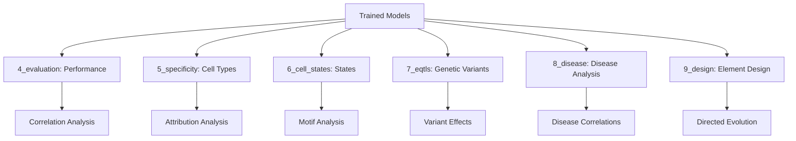

# Decima Analysis Scripts Structure

## 1. ANALYSIS PIPELINE OVERVIEW

The Decima analysis pipeline consists of 6 major analysis stages (4-9) that apply trained models to different research questions:



## 2. STAGE 4: MODEL EVALUATION

### Purpose
Comprehensive assessment of model performance on held-out test data.

### Key Scripts Structure

**00_predict.py** - Prediction Generation
```python
# Core workflow:
1. Load trained model checkpoints (multiple replicates)
2. Generate predictions on test set using ensemble
3. Calculate gene-level and sample-level correlations
4. Save predictions with metadata for downstream analysis

# Key functions:
- model_predict(): Single model prediction
- ensemble_predict(): Multi-model ensemble
- calculate_correlations(): Performance metrics
```

**01_evaluate.py** - Performance Analysis  
```python
# Analysis framework:
1. Load prediction results from multiple models
2. Calculate performance metrics:
   - Gene-level Pearson correlations
   - Track-level correlations (expression patterns)
   - Size factor correlations (technical controls)
3. Compare across datasets (train/val/test)
4. Statistical analysis of performance distributions

# Key outputs:
- Performance summary statistics
- Correlation distribution plots
- Dataset-specific performance analysis
```

### Evaluation Metrics Framework

**Hierarchical Performance Analysis:**
```python
# Level 1: Gene-level performance
gene_correlations = []
for gene in all_genes:
    corr = pearsonr(predictions[gene], targets[gene])
    gene_correlations.append(corr)

# Level 2: Sample-level performance  
sample_correlations = []
for sample in all_samples:
    corr = pearsonr(predictions[sample, :], targets[sample, :])
    sample_correlations.append(corr)

# Level 3: Dataset-level performance
for dataset in ['train', 'val', 'test']:
    dataset_corr = analyze_dataset_performance(dataset)
```

## 3. STAGE 5: CELL-TYPE SPECIFICITY ANALYSIS

### Purpose
Analyze model's ability to predict cell-type-specific gene expression patterns.

### Key Scripts Structure

**00_combined_attribution_analysis.py** - Unified Attribution Pipeline
```python
# Complete attribution workflow:
1. Load model ensembles and test genes
2. Calculate InputXGradient attributions for each gene/cell type
3. Process attributions with genomic annotations:
   - ENCODE cCREs (regulatory elements)
   - GTF exons/introns (gene structure)
   - Tissue-specific ATAC-seq peaks
4. Statistical analysis of attribution enrichment
5. Generate summary reports and visualizations

# Key components:
class AttributionAnalyzer:
    - calculate_attributions(): Captum-based attribution
    - annotate_genomic_regions(): Overlap with regulatory elements
    - statistical_enrichment(): Significance testing
    - strand_aware_processing(): Handle DNA strand orientation
```

**01_evaluate_specific.py** - Cell Type Marker Analysis
```python
# Marker gene analysis:
1. Load cell type marker gene definitions
2. Calculate cell-type-specific z-scores:
   z_score = (expr_celltype - expr_background) / std_background
3. Compare predicted vs observed marker scores:
   - AUROC for cell type classification
   - AUPRC for marker identification
   - Pearson correlation of specificity patterns

# Key functions:
- marker_zscores(): Calculate specificity scores  
- compare_marker_zscores(): Pred vs obs comparison
- compute_marker_metrics(): AUROC/AUPRC calculation
```

**03_calculate_attributions.py** - Attribution Computation
```python
# Attribution calculation pipeline:
1. Filter genes by expression level (>1.5 log-expression)
2. For each gene/cell type pair:
   - Load genomic sequence
   - Calculate InputXGradient attributions
   - Apply baseline subtraction
3. Aggregate across model ensemble
4. Save attribution arrays for downstream analysis

# Technical details:
- Uses Captum InputXGradient method
- Baseline: shuffled sequence
- Attribution shape: [sequence_length, 4] (DNA bases)
- Ensemble averaging across model replicates
```

**04_analyze_attributions.py** - Genomic Region Analysis
```python
# Systematic genomic analysis:
1. Load attribution arrays and genomic annotations
2. For each genomic region type:
   - Calculate mean attribution scores
   - Compare to background regions
   - Statistical significance testing
3. Distance-based analysis:
   - Attribution vs distance to TSS
   - Regulatory element proximity effects
4. Generate summary statistics and visualizations

# Analysis categories:
- Promoter regions (-2kb to +1kb from TSS)
- Gene bodies (exons vs introns)
- ENCODE cCREs (regulatory elements)  
- ATAC-seq peaks (tissue-specific chromatin accessibility)
```

### Attribution Analysis Framework

**Multi-Level Attribution Analysis:**
```python
# Level 1: Sequence-level attributions
attributions = InputXGradient.attribute(
    inputs=sequences,
    baselines=shuffled_sequences, 
    target=target_outputs
)

# Level 2: Genomic region aggregation
region_scores = {}
for region in genomic_regions:
    region_attrs = attributions[region.start:region.end]
    region_scores[region.id] = region_attrs.mean()

# Level 3: Statistical enrichment
enrichment_pvals = []
for region_type in ['promoter', 'exon', 'cCRE']:
    pval = mannwhitneyu(
        region_scores[region_type],
        region_scores['background']
    )
    enrichment_pvals.append(pval)
```

## 4. STAGE 6: CELL STATE ANALYSIS

### Purpose
Analyze cell state-specific regulatory patterns and discover motifs.

### Key Scripts Structure

**0_lung_run.py** - Lung Cell Type Analysis
```python
# Cell state analysis workflow:
1. Define lung cell types of interest:
   - Type I pneumocytes
   - Type II pneumocytes  
   - Club cells
   - Ciliated cells
   - Secretory cells
2. For each cell type:
   - Calculate cell-type-specific attributions
   - Run TF-MoDISco motif discovery
   - Compare motifs to JASPAR database
3. Ensemble analysis across model replicates

# Key parameters:
- Top 250 genes by cell-type specificity
- Attribution threshold: 95th percentile
- Motif length range: 6-20bp
- Statistical significance: FDR < 0.05
```

**Interpret.py** - Attribution Calculation Utilities
```python
class AttributionCalculator:
    def __init__(self, model, method='InputXGradient'):
        self.model = model
        self.method = getattr(captum.attr, method)(model)
    
    def calculate(self, sequences, targets, cell_type_mask):
        """Calculate cell-type-specific attributions"""
        # Apply cell type mask to target outputs
        masked_targets = targets * cell_type_mask
        
        # Calculate attributions
        attributions = self.method.attribute(
            inputs=sequences,
            target=masked_targets,
            baselines=self.get_baselines(sequences)
        )
        return attributions
    
    def aggregate_ensemble(self, attribution_list):
        """Average attributions across model ensemble"""
        return torch.mean(torch.stack(attribution_list), dim=0)
```

**InterpretModisco.py** - TF-MoDISco Analysis Pipeline
```python
class ModiscoAnalyzer:
    def __init__(self, attribution_data, sequence_data):
        self.attributions = attribution_data
        self.sequences = sequence_data
    
    def run_modisco(self):
        """Run TF-MoDISco motif discovery"""
        # Prepare data for MoDISco
        task_to_scores = self.prepare_scores()
        task_to_hyp_scores = self.prepare_hypothetical_scores()
        
        # Run MoDISco
        factory = modisco.tfmodisco_workflow.factory.TfModiscoWorkflowFactory()
        workflow = factory.create()
        results = workflow(
            task_names=['task0'],
            contrib_scores=task_to_scores,
            hypothetical_contribs=task_to_hyp_scores,
            one_hot=self.sequences
        )
        return results
    
    def compare_to_jaspar(self, motifs):
        """Compare discovered motifs to JASPAR database"""
        jaspar_matches = []
        for motif in motifs:
            best_match = self.motif_similarity_search(motif)
            jaspar_matches.append(best_match)
        return jaspar_matches
```

### Cell State Analysis Framework

**Cell Type Specificity Calculation:**
```python
# Define cell type specificity score
def calculate_specificity(expression_matrix, cell_type_labels):
    specificity_scores = {}
    
    for cell_type in unique_cell_types:
        # Target cell type vs all others
        target_mask = (cell_type_labels == cell_type)
        background_mask = (cell_type_labels != cell_type)
        
        target_expr = expression_matrix[target_mask].mean(axis=0)
        background_expr = expression_matrix[background_mask].mean(axis=0)
        background_std = expression_matrix[background_mask].std(axis=0)
        
        # Z-score based specificity
        z_scores = (target_expr - background_expr) / background_std
        specificity_scores[cell_type] = z_scores
    
    return specificity_scores
```

## 5. STAGE 7: eQTL ANALYSIS

### Purpose
Predict genetic variant effects on gene expression.

### Key Scripts Structure

**0_predict.py** - eQTL Prediction Setup
```python
# eQTL analysis pipeline:
1. Load OneK1K eQTL study data:
   - SuSiE credible sets (fine-mapped variants)
   - Summary statistics
   - Cell type annotations
2. Process variants:
   - Filter indels and blacklisted regions
   - Create matched negative controls
   - Map variants to genomic coordinates
3. Run variant effect prediction:
   - Decima model predictions (ensemble)
   - Borzoi baseline predictions
   - Both reference and alternative alleles

# Data processing:
- Credible set variants: ~50K high-confidence eQTLs
- Negative controls: Distance-matched non-eQTL variants
- Cell types: 14 major immune cell populations
```

**PredicteQTL.py** - Decima Variant Prediction
```python
class DecimaVariantPredictor:
    def __init__(self, model_checkpoints, genome):
        self.models = [load_model(ckpt) for ckpt in model_checkpoints]
        self.genome = genome
    
    def predict_variant_effect(self, variant):
        """Predict expression change for genetic variant"""
        # Get reference and alternative sequences
        ref_seq = self.get_sequence(variant, allele='ref')
        alt_seq = self.get_sequence(variant, allele='alt') 
        
        # Predict expression for both alleles
        ref_pred = self.ensemble_predict(ref_seq)
        alt_pred = self.ensemble_predict(alt_seq)
        
        # Calculate effect size (log fold change)
        effect_size = torch.log(alt_pred / ref_pred)
        return effect_size
    
    def ensemble_predict(self, sequence):
        """Average predictions across model ensemble"""
        predictions = []
        for model in self.models:
            pred = model(sequence)
            predictions.append(pred)
        return torch.mean(torch.stack(predictions), dim=0)
```

**Borzoi.py** - Baseline Model Predictions
```python
class BorzoiVariantPredictor:
    """Borzoi baseline for comparison with Decima"""
    
    def __init__(self, model_path):
        self.model = self.load_borzoi_model(model_path)
    
    def predict_variant_effect(self, variant):
        """Borzoi variant effect prediction"""
        # Similar to Decima but using Borzoi architecture
        ref_seq = self.get_sequence(variant, allele='ref')
        alt_seq = self.get_sequence(variant, allele='alt')
        
        ref_pred = self.model(ref_seq)
        alt_pred = self.model(alt_seq)
        
        return torch.log(alt_pred / ref_pred)
```

### eQTL Analysis Framework

**Classification Performance Analysis:**
```python
# Evaluate variant effect prediction
def evaluate_eqtl_prediction(predictions, true_labels):
    """Evaluate eQTL vs non-eQTL classification"""
    
    # ROC analysis
    fpr, tpr, thresholds = roc_curve(true_labels, predictions)
    auroc = auc(fpr, tpr)
    
    # Precision-Recall analysis
    precision, recall, _ = precision_recall_curve(true_labels, predictions)
    auprc = auc(recall, precision)
    
    # Effect size correlation
    true_effects = load_true_effect_sizes()
    effect_corr = pearsonr(predictions, true_effects)
    
    return {
        'AUROC': auroc,
        'AUPRC': auprc,
        'effect_correlation': effect_corr
    }
```

## 6. STAGE 8: DISEASE ANALYSIS

### Purpose
Analyze disease-associated gene expression changes.

### Key Scripts Structure

**0_overall.py** - Disease vs Healthy Analysis
```python
# Disease correlation analysis:
1. Identify disease vs healthy pairs:
   - Same study, tissue, cell type
   - Sufficient sample sizes (>500 cells)
   - Clear disease/healthy labels
2. Calculate log fold changes:
   - Observed: disease vs healthy expression
   - Predicted: model predictions on disease vs healthy
3. Correlation analysis:
   - Pearson correlation between predicted and observed LFC
   - Control for size factors and technical effects
4. Statistical significance testing

# Disease categories analyzed:
- Inflammatory diseases (IBD, psoriasis)  
- Neurological diseases (Alzheimer's, MS)
- Cancer (multiple tumor types)
- Metabolic diseases (diabetes)
```

**Disease Analysis Framework:**
```python
def analyze_disease_correlation(adata, model_predictions):
    """Analyze disease vs healthy expression changes"""
    
    disease_results = {}
    
    for disease in adata.obs['disease'].unique():
        if disease == 'healthy':
            continue
            
        # Get disease and healthy samples
        disease_mask = (adata.obs['disease'] == disease)
        healthy_mask = (adata.obs['disease'] == 'healthy')
        
        # Calculate observed log fold change
        obs_disease = adata.X[disease_mask].mean(axis=0)
        obs_healthy = adata.X[healthy_mask].mean(axis=0)
        obs_lfc = np.log(obs_disease / obs_healthy)
        
        # Calculate predicted log fold change
        pred_disease = model_predictions[disease_mask].mean(axis=0)
        pred_healthy = model_predictions[healthy_mask].mean(axis=0)
        pred_lfc = np.log(pred_disease / pred_healthy)
        
        # Correlation analysis
        correlation = pearsonr(obs_lfc, pred_lfc)
        disease_results[disease] = correlation
    
    return disease_results
```

## 7. STAGE 9: REGULATORY ELEMENT DESIGN

### Purpose
Design synthetic regulatory elements with desired cell-type specificity.

### Key Scripts Structure

**00_evolve_combined.py** - Streamlined Evolution Pipeline
```python
# Directed evolution workflow:
1. Define optimization target:
   - Target cell type (e.g., fibroblasts)
   - Target condition (e.g., ulcerative colitis)
   - Specificity function: target - background expression
2. Initialize starting sequence:
   - Random 200bp promoter sequence
   - EBFP reporter gene
   - Genomic insertion coordinates
3. Evolution algorithm:
   - Test all single nucleotide mutations
   - Select mutation maximizing target function
   - Apply best mutation and iterate
   - Early stopping when converged
4. Analysis and validation:
   - Track optimization trajectory
   - Analyze final sequence properties
   - Compare across model architectures

# Key parameters:
- Sequence length: 200bp promoter
- Reporter gene: EBFP (enhanced blue fluorescent protein)
- Optimization metric: Cell-type specificity score
- Convergence threshold: <1% improvement over 10 iterations
```

**0_evolve.py** - Detailed Evolution Implementation
```python
class DirectedEvolution:
    def __init__(self, model, target_function, starting_sequence):
        self.model = model
        self.target_function = target_function
        self.sequence = starting_sequence
        self.history = []
    
    def evolve(self, max_iterations=1000):
        """Run directed evolution algorithm"""
        for iteration in range(max_iterations):
            # Test all possible single mutations
            best_mutation = self.find_best_mutation()
            
            if best_mutation is None:
                print(f"Converged at iteration {iteration}")
                break
                
            # Apply best mutation
            self.apply_mutation(best_mutation)
            self.history.append(best_mutation)
            
            # Early stopping check
            if self.check_convergence():
                break
        
        return self.sequence, self.history
    
    def find_best_mutation(self):
        """Test all single nucleotide mutations"""
        current_score = self.evaluate_sequence(self.sequence)
        best_score = current_score
        best_mutation = None
        
        for pos in range(len(self.sequence)):
            for base in ['A', 'T', 'G', 'C']:
                if self.sequence[pos] == base:
                    continue
                
                # Test mutation
                mutated_seq = self.apply_mutation_temp(pos, base)
                score = self.evaluate_sequence(mutated_seq)
                
                if score > best_score:
                    best_score = score
                    best_mutation = (pos, base)
        
        return best_mutation
    
    def evaluate_sequence(self, sequence):
        """Evaluate sequence using target function"""
        # Construct full sequence with reporter
        full_sequence = sequence + self.reporter_gene
        
        # Model prediction
        prediction = self.model(full_sequence)
        
        # Target function (e.g., specificity score)
        score = self.target_function(prediction)
        return score
```

### Evolution Framework

**Target Function Definition:**
```python
def cell_type_specificity_score(predictions, target_cell_type):
    """Calculate cell-type specificity for evolution"""
    
    # Get predictions for target cell type vs others
    target_expr = predictions[target_cell_type]
    background_expr = predictions.drop(target_cell_type, axis=1).mean(axis=1)
    
    # Specificity score: target - background
    specificity = target_expr - background_expr
    
    # Additional constraints (optional):
    # - Minimum expression level
    # - Maximum off-target expression
    # - Sequence constraints (GC content, repeats)
    
    return specificity.sum()
```

**Multi-Architecture Comparison:**
```python
# Compare evolution across different model types
model_types = [
    'human_decima',      # Human-pretrained Decima
    'mouse_decima',      # Mouse-pretrained Decima  
    'human_borzoi',      # Human Borzoi baseline
    'mouse_borzoi',      # Mouse Borzoi baseline
    'random_init'        # Randomly initialized
]

evolution_results = {}
for model_type in model_types:
    model = load_model(model_type)
    evolver = DirectedEvolution(model, target_function, initial_sequence)
    final_seq, history = evolver.evolve()
    evolution_results[model_type] = {
        'sequence': final_seq,
        'trajectory': history,
        'final_score': evolver.evaluate_sequence(final_seq)
    }
```

## 8. COMPUTATIONAL WORKFLOW PATTERNS

### Common Analysis Patterns

**1. Ensemble Model Loading:**
```python
def load_model_ensemble(checkpoint_paths):
    """Standard pattern for loading model ensembles"""
    models = []
    for path in checkpoint_paths:
        model = LightningModel.load_from_checkpoint(path)
        model.eval()
        models.append(model)
    return models
```

**2. Batch Processing Framework:**
```python
def process_in_batches(data, model, batch_size=32):
    """Standard batch processing for large datasets"""
    results = []
    for i in range(0, len(data), batch_size):
        batch = data[i:i+batch_size]
        with torch.no_grad():
            batch_results = model(batch)
        results.append(batch_results.cpu().numpy())
    return np.concatenate(results)
```

**3. Statistical Analysis Framework:**
```python
def statistical_analysis(predictions, targets, metadata):
    """Common statistical analysis patterns"""
    results = {
        'overall_correlation': pearsonr(predictions.flatten(), targets.flatten()),
        'per_gene_correlations': [],
        'per_sample_correlations': [],
        'metadata_stratified': {}
    }
    
    # Per-gene analysis
    for i in range(predictions.shape[1]):
        corr = pearsonr(predictions[:, i], targets[:, i])
        results['per_gene_correlations'].append(corr)
    
    # Metadata stratification
    for category in metadata.columns:
        for value in metadata[category].unique():
            mask = (metadata[category] == value)
            subset_corr = pearsonr(
                predictions[mask].flatten(),
                targets[mask].flatten()
            )
            results['metadata_stratified'][f"{category}_{value}"] = subset_corr
    
    return results
```

### HPC Integration Patterns

**SLURM Job Submission:**
```bash
# Common SLURM script pattern
#!/bin/bash
#SBATCH --job-name=decima_analysis
#SBATCH --nodes=1
#SBATCH --ntasks=1
#SBATCH --cpus-per-task=8
#SBATCH --mem=64G
#SBATCH --gres=gpu:1
#SBATCH --time=24:00:00

module load anaconda
cd /code/daniodecima-applications-main/notebooks/
python script_name.py
```

This comprehensive analysis framework enables systematic investigation of genomic sequence-to-function relationships across multiple biological contexts and applications.