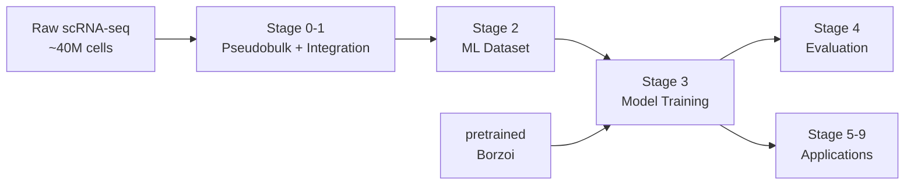

# Decima: Comprehensive Repository Analysis

## Executive Summary

This document provides a comprehensive analysis of the Decima repository structure, dependencies, and workflows. Decima is a sophisticated machine learning framework for predicting single-cell gene expression from genomic DNA sequences, built upon the Borzoi architecture and designed for cell-type-specific analysis.

## 📁 Repository Structure Overview

The repository is organized into two main components:

### **decima-main/** - Core Framework (17 Python modules)
- **Core Model**: DecimaModel (Borzoi-based architecture with gene masking)
- **Training**: PyTorch Lightning framework with custom loss functions
- **Data**: HDF5-based data loading and preprocessing utilities
- **Analysis**: Attribution, evaluation, and visualization tools
- **Scripts**: Training, prediction, and experimental pipelines

### **decima-applications-main/notebooks/** - Research Pipeline (100+ Python scripts)
- **10-stage sequential pipeline** (Stages 0-9)
- **50+ analysis notebooks** converted to Python scripts
- **Complete workflow** from raw single-cell data to regulatory element design

## 🔗 Dependency Architecture

### Core Dependencies Flow
```
External Libraries → decima-main/src/ → decima-applications-main/notebooks/
     ↓                    ↓                         ↓
- torch/lightning    - Model classes         - Analysis scripts
- grelu             - Data loaders          - Research workflows  
- captum            - Loss functions        - Visualization
- genomepy          - Evaluation tools      - Statistical analysis
```

### Key External Dependencies
- **Deep Learning**: PyTorch, PyTorch Lightning, Grelu
- **Genomics**: genomepy, bioframe, pymemesuite, scanpy
- **Analysis**: captum, numpy, pandas, scipy
- **Visualization**: plotnine, matplotlib
- **Experiment Tracking**: WandB, TensorBoard

## 🧬 Scientific Pipeline Architecture

### Data Flow: Raw Data → Trained Models → Applications


### 10-Stage Analysis Pipeline

| Stage | Purpose | Key Outputs | Dependencies |
|-------|---------|-------------|--------------|
| **0** | Single-cell data prep | Pseudobulk profiles | Raw atlases |
| **1** | Multi-atlas integration | Combined dataset | Stage 0 |
| **2** | ML dataset creation | HDF5 format | Stage 1, genomic annotations |
| **3** | Model training | Trained checkpoints | Stage 2, pretrained Borzoi |
| **4** | Model evaluation | Performance metrics | Stage 3 |
| **5** | Cell-type specificity | Attribution analysis | Stage 3, ENCODE annotations |
| **6** | Cell state analysis | Motif discovery | Stage 3, TF databases |
| **7** | Genetic variants | eQTL predictions | Stage 3, variant databases |
| **8** | Disease analysis | Disease correlations | Stage 3, disease samples |
| **9** | Element design | Synthetic promoters | Stage 3, evolution algorithm |

## 🏗️ Model Architecture

### DecimaModel Core Components
```
Input: [batch, 5, 524288]  # DNA sequence + gene mask
    ↓
Stem: Conv1D(5→512, k=15) + BatchNorm + GELU
    ↓
CNN Tower: 7× [Conv1D(512→512, k=5) + Residual]
    ↓
Transformer: 8× [MultiHead(8) + FFN + LayerNorm]
    ↓
Head: Conv1D(1920→num_genes)
    ↓
Output: torch.exp() → Gene expression counts
```

### Key Innovations
1. **Gene Mask Channel**: 5th input channel for target gene specification
2. **Multi-task Learning**: Predicts thousands of genes simultaneously  
3. **Transfer Learning**: Fine-tunes from pretrained Borzoi weights
4. **Cell-type Specificity**: Ensemble predictions across cell types
5. **Temporal Modeling**: Extension for time-series forecasting

## 🔬 Training and Validation Framework

### Training Strategy
- **Architecture**: Fine-tuned from pretrained human/mouse Borzoi
- **Data**: ~100K pseudobulk samples across ~26K genes
- **Loss**: TaskWisePoissonMultinomialLoss (Poisson + Multinomial)
- **Optimization**: Adam (lr=3e-5), gradient clipping, mixed precision
- **Hardware**: Multi-GPU distributed training (8×A100)

### Validation Approach
- **Genomic splits**: Borzoi fold assignments prevent overfitting
- **Metrics**: Gene-level and sample-level Pearson correlations
- **Ensemble**: Multiple replicates for robust performance
- **Early stopping**: Based on validation correlation

### Performance Benchmarks
- **Gene-level correlation**: 0.6-0.8 median across genes
- **Cell-type specificity**: AUROC 0.85+ for marker genes
- **Variant effects**: AUROC 0.75+ for eQTL prediction
- **Disease correlation**: 0.4-0.6 across disease types

## 📊 Analysis Framework Structure

### Stage 4-9 Analysis Types

**Performance Analysis (Stage 4)**
- Model validation on held-out genes
- Cross-dataset generalization testing
- Statistical performance characterization

**Attribution Analysis (Stages 5-6)**
- InputXGradient attribution calculation
- Genomic region enrichment analysis
- Cell-type-specific motif discovery
- TF-MoDISco motif analysis

**Variant Analysis (Stage 7)**
- eQTL effect prediction and classification
- Comparison with Borzoi baseline
- Cell-type-specific variant effects

**Disease Analysis (Stage 8)**
- Disease vs healthy expression correlations
- Log fold change prediction accuracy
- Disease-specific regulatory patterns

**Design Analysis (Stage 9)**
- Directed evolution for synthetic elements
- Cell-type-specific promoter optimization
- Multi-architecture comparison

### Common Analysis Patterns
1. **Ensemble Processing**: Multiple model replicates for robustness
2. **Batch Processing**: Efficient GPU utilization for large datasets
3. **Statistical Analysis**: Comprehensive correlation and significance testing
4. **HPC Integration**: SLURM job submission and parallel processing
5. **Reproducibility**: Comprehensive seed control and version tracking

## 💻 Computational Requirements

### Hardware Requirements
- **Training**: 8×A100 GPUs, 256GB RAM, 2TB storage
- **Analysis**: 1×A100 GPU, 64GB RAM, 500GB storage
- **Time**: 1 week full training, 2-3 days analysis pipeline

### Software Environment
- **Base**: Python 3.8+, PyTorch 1.12+, PyTorch Lightning
- **Genomics**: grelu, genomepy, bioframe, scanpy
- **Analysis**: captum, scipy, pandas, plotnine
- **HPC**: SLURM integration, module loading (anaconda)

## 🔍 Key File Types and Patterns

### Data Formats
- **`.h5ad`**: AnnData single-cell datasets
- **`.h5`**: HDF5 ML-ready training data
- **`.ckpt`**: PyTorch Lightning model checkpoints
- **`.gtf`**: Genomic annotations
- **`.bed`**: Genomic intervals

### Code Organization
- **`.py`**: All analysis code (converted from notebooks)
- **`__main__.py`**: Package entry points
- **`.sh`**: SLURM job submission scripts
- **`.yml`**: Conda environment specifications

### Analysis Outputs
- Attribution arrays (HDF5 format)
- Performance metrics (CSV/JSON)
- Motif analysis results (MEME format)
- Visualization plots (PNG/PDF)
- Evolved sequences (FASTA format)

## 🧪 Research Applications and Impact

### Demonstrated Capabilities
1. **Cell-Type Specificity**: Accurate prediction of cell-type-specific expression
2. **Regulatory Element Discovery**: Identification of important genomic regions
3. **Variant Effect Prediction**: eQTL classification and effect size prediction
4. **Disease Analysis**: Correlation with disease-associated expression changes
5. **Synthetic Biology**: Design of cell-type-specific regulatory elements

### Novel Contributions
1. **Multi-Atlas Integration**: Harmonization of diverse single-cell datasets
2. **Gene Mask Architecture**: Extension of Borzoi for gene-specific prediction
3. **Pseudobulk Training Strategy**: Effective use of single-cell data for sequence modeling
4. **Comprehensive Evaluation Framework**: Multi-level performance assessment
5. **Directed Evolution Pipeline**: Automated regulatory element design

## 📚 Documentation Structure

This analysis consists of four detailed documents:

1. **[DECIMA_STRUCTURE_ANALYSIS.md](DECIMA_STRUCTURE_ANALYSIS.md)**: Detailed folder structure and dependency mapping
2. **[TRAINING_VALIDATION_WORKFLOW.md](TRAINING_VALIDATION_WORKFLOW.md)**: Complete training pipeline documentation
3. **[ANALYSIS_SCRIPTS_STRUCTURE.md](ANALYSIS_SCRIPTS_STRUCTURE.md)**: Analysis framework and methodology
4. **[CLAUDE.md](CLAUDE.md)**: Quick reference for future development

## 🚀 Getting Started

### Prerequisites
```bash
module load anaconda
pip install jupytext
```

### Quick Start
```bash
# 1. Convert notebooks (already done)
find . -name "*.ipynb" -exec jupytext --to py {} \;

# 2. Core package development
cd decima-main/
pytest  # Run tests
python -m build  # Build package

# 3. Analysis pipeline
cd ../decima-applications-main/notebooks/
python 0_sc_data_prep/bca_prep.py  # Start pipeline
```

### Key Commands
- **Testing**: `pytest --cov decima --cov-report term-missing`
- **Building**: `python -m build`
- **Code Quality**: `flake8 src/`
- **Documentation**: `sphinx-build docs/ docs/_build/html`

## 🎯 Conclusion

The Decima repository represents a comprehensive framework for genomic sequence-to-function modeling, combining:

- **Sophisticated ML Architecture**: Gene-masked Borzoi with transfer learning
- **Comprehensive Data Integration**: Multi-atlas single-cell data harmonization  
- **Robust Training Framework**: PyTorch Lightning with custom genomics losses
- **Extensive Analysis Pipeline**: 10-stage research workflow with 100+ scripts
- **Practical Applications**: From variant prediction to synthetic element design

The codebase demonstrates best practices for reproducible computational genomics research, with clear separation of core framework and research applications, comprehensive documentation, and integration with HPC environments.

This analysis provides the foundation for understanding, extending, and applying the Decima framework to new genomic sequence modeling challenges.