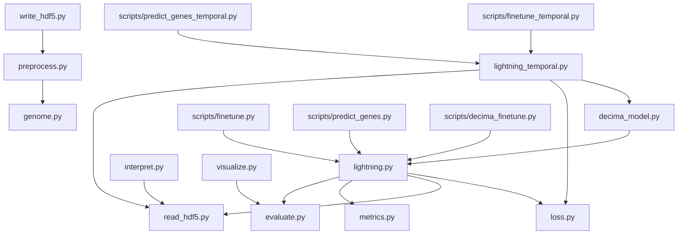
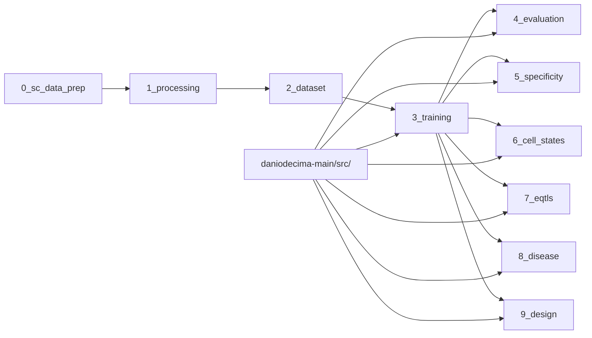
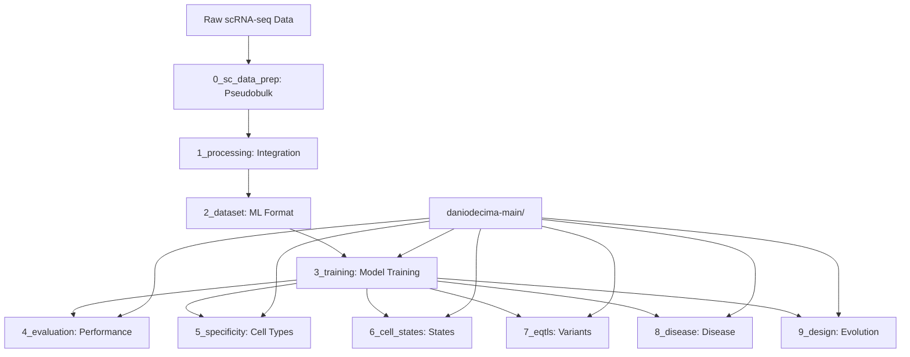

# Decima Repository Structure and Dependency Analysis

## 1. FOLDER STRUCTURE DIAGRAM

```
step/
├── daniodecima-main/                          # Core Decima Package
│   ├── src/decima/                       # Main source code
│   │   ├── decima_model.py              # [CORE] DecimaModel class (Borzoi wrapper)
│   │   ├── lightning.py                 # [CORE] PyTorch Lightning training
│   │   ├── lightning_temporal.py        # [CORE] Temporal forecasting models
│   │   ├── read_hdf5.py                # [DATA] HDF5 dataset classes  
│   │   ├── write_hdf5.py               # [DATA] HDF5 data conversion
│   │   ├── preprocess.py               # [DATA] Data preprocessing utilities
│   │   ├── loss.py                     # [LOSS] Custom loss functions
│   │   ├── metrics.py                  # [EVAL] Custom metrics
│   │   ├── evaluate.py                 # [EVAL] Cell-type evaluation
│   │   ├── interpret.py                # [INTERP] Attribution analysis
│   │   ├── visualize.py                # [VIZ] Plotting utilities
│   │   ├── variant.py                  # [VAR] Variant processing
│   │   └── genome.py                   # [GEN] Genome utilities
│   ├── scripts/                         # Training & prediction scripts
│   │   ├── finetune.py                 # Standard training script
│   │   ├── finetune_temporal.py        # Temporal model training
│   │   ├── decima_finetune.py          # Systematic experiments
│   │   ├── predict_genes.py            # Gene expression prediction
│   │   ├── predict_genes_temporal.py   # Temporal forecasting
│   │   └── decima_predictions.py       # Alternative prediction
│   ├── tests/                           # Test suite
│   └── docs/                            # Documentation
│
├── daniodecima-applications-main/            # Research Applications
│   └── notebooks/                       # Analysis pipeline
│       ├── 0_sc_data_prep/             # [STAGE 0] Pseudobulk preparation
│       │   ├── bca_prep.py             # Brain Cell Atlas
│       │   ├── heart-prep.py           # Heart Atlas
│       │   ├── lung-prep.py            # Lung Atlas
│       │   ├── retina-prep.py          # Retina Atlas
│       │   ├── skin-prep.py            # Skin Atlas
│       │   └── zf-prep.py              # Zebrafish data
│       │
│       ├── 1_processing/               # [STAGE 1] Data integration
│       │   ├── 00_scimilarity.py       # Scimilarity database processing
│       │   ├── 01_brain_atlas.py       # Brain atlas processing
│       │   ├── 02_skin_atlas.py        # Skin atlas processing
│       │   ├── 03_retina_atlas.py      # Retina atlas processing
│       │   ├── 04_combine_atlases.py   # Multi-atlas integration
│       │   ├── 05_aggregate.py         # Final data aggregation
│       │   └── scimilarity.py          # Mapping dictionaries
│       │
│       ├── 2_dataset/                  # [STAGE 2] Dataset preparation
│       │   ├── 01_make_intervals.py    # Genomic intervals
│       │   ├── 02_split.py             # Train/val/test splits
│       │   ├── 03_make_h5.py           # HDF5 conversion
│       │   └── zebrafish.py            # Zebrafish datasets
│       │
│       ├── 3_training/                 # [STAGE 3] Model training
│       │   ├── 01_finetune.py          # Training orchestration
│       │   └── __main__.py             # Entry point
│       │
│       ├── 4_evaluation/               # [STAGE 4] Model evaluation
│       │   ├── 00_predict.py           # Prediction generation
│       │   ├── 01_evaluate.py          # Performance analysis
│       │   └── 00_submit_predict_decima.sh
│       │
│       ├── 5_specificity/              # [STAGE 5] Cell-type specificity
│       │   ├── 00_combined_attribution_analysis.py
│       │   ├── 01_evaluate_specific.py  # Marker analysis
│       │   ├── 02_examples.py          # Specificity examples
│       │   ├── 03_calculate_attributions.py
│       │   ├── 04_analyze_attributions.py
│       │   ├── 05_fabp1.py             # FABP1 case study
│       │   └── 00_submit_combined_attributions.sh
│       │
│       ├── 6_cell_states/              # [STAGE 6] Cell state analysis
│       │   ├── 0_lung_run.py           # Lung cell types
│       │   ├── 1_lung_analysis.py      # Lung analysis
│       │   ├── 2_neurons_analysis.py   # Neuron analysis
│       │   ├── 3_neuron_modisco.py     # Neuron motifs
│       │   ├── 4_others_run.py         # Other cell types
│       │   ├── 5_tregs.py              # T-regulatory cells
│       │   ├── 6_fibroblasts.py        # Fibroblast analysis
│       │   ├── Interpret.py            # Attribution utilities
│       │   ├── InterpretModisco.py     # Motif analysis
│       │   ├── celltype_motif_attribution.py
│       │   ├── modisco_simple.py       # MoDISco interface
│       │   └── motif_meta.py           # Motif metadata
│       │
│       ├── 7_eqtls/                    # [STAGE 7] Genetic variants
│       │   ├── 0_predict.py            # eQTL prediction setup
│       │   ├── 1_process.py            # eQTL data processing
│       │   ├── 2_classification.py     # Variant classification
│       │   ├── 3_effect_size.py        # Effect size analysis
│       │   ├── 4_finemapping_cell_type.py
│       │   ├── 5_example.py            # eQTL examples
│       │   ├── Borzoi.py               # Borzoi predictions
│       │   ├── PredicteQTL.py          # Decima predictions
│       │   └── eqtl_meta.py            # eQTL metadata
│       │
│       ├── 8_disease/                  # [STAGE 8] Disease analysis
│       │   ├── 0_overall.py            # Disease correlation
│       │   ├── 1_modisco.py            # Disease motifs
│       │   ├── 2_examples.py           # Disease examples
│       │   ├── Interpret.py            # Attribution tools
│       │   └── InterpretModisco.py     # Motif analysis
│       │
│       └── 9_design/                   # [STAGE 9] Element design
│           ├── 00_evolve_combined.py   # Evolution pipeline
│           ├── 0_evolve.py             # Directed evolution
│           ├── 1_read.py               # Design analysis
│           ├── 1_read_celltypes.py     # Cell-type designs
│           └── 00_submit_evolve_combined.sh
│
└── CLAUDE.md                           # Claude Code guidance
```

## 2. CORE DEPENDENCY MAP

### Internal Dependencies (daniodecima-main/)



### External Dependencies

**Core Libraries:**
- `torch` + `pytorch_lightning` (deep learning)
- `grelu` (genomic ML utilities) 
- `h5py` + `anndata` (data storage)
- `numpy` + `pandas` (data processing)
- `captum` (model interpretation)
- `wandb` (experiment tracking)

**Genomics Libraries:**
- `genomepy` (genome management)
- `bioframe` (genomic intervals)
- `pymemesuite` (motif analysis)
- `scanpy` (single-cell analysis)

## 3. APPLICATION PIPELINE DEPENDENCIES

### Stage-by-Stage Dependencies



### Key Cross-Dependencies

**Applications → Core Package:**
- All stages 3-9 import from `/code/decima/src/decima/`
- Stage 2: `write_hdf5.py`, `preprocess.py`
- Stage 3: `lightning.py`, `decima_model.py`
- Stages 4-9: `interpret.py`, `evaluate.py`, `read_hdf5.py`

**Internal Application Dependencies:**
- Stage 1 → Stage 0 (processed pseudobulk data)
- Stage 2 → Stage 1 (integrated datasets)
- Stage 3 → Stage 2 (HDF5 training data)
- Stages 4-9 → Stage 3 (trained model checkpoints)

## 4. DATA FLOW ARCHITECTURE



## 5. KEY ARCHITECTURAL PATTERNS

### 1. Core-Application Separation
- **daniodecima-main/**: Reusable ML framework
- **applications/**: Research-specific analyses

### 2. Sequential Pipeline
- Numbered directories (0-9) enforce analysis order
- Each stage depends on previous stages' outputs
- Clear data provenance and reproducibility

### 3. Multi-Modal Analysis
- Same trained models used across multiple analysis types
- Attribution analysis (stages 5-6)
- Variant prediction (stage 7)  
- Disease analysis (stage 8)
- Design optimization (stage 9)

### 4. HPC Integration
- SLURM job submission scripts throughout
- Multi-GPU distributed training
- Batch processing for large-scale analyses

### 5. Ensemble Modeling
- Multiple model replicates for robustness
- Ensemble predictions in evaluation stages
- Statistical significance testing

## 6. FILE TYPE PATTERNS

### Data Files
- `.h5ad`: AnnData single-cell data
- `.h5`: HDF5 ML-ready datasets
- `.ckpt`: PyTorch Lightning checkpoints
- `.gtf`: Gene annotations
- `.bed`: Genomic intervals

### Code Files
- `.py`: All notebook code (converted from .ipynb)
- `.sh`: SLURM job submission scripts
- `.yml`: Conda environment files
- `.txt`: Metadata and configuration files

### Analysis Outputs
- Attribution arrays (.h5)
- Correlation matrices (.csv)
- Motif analysis results (.meme)
- Evolved sequences (.fa)

This structure represents a comprehensive machine learning pipeline for genomic sequence-to-function modeling, from raw single-cell data to functional regulatory element design.