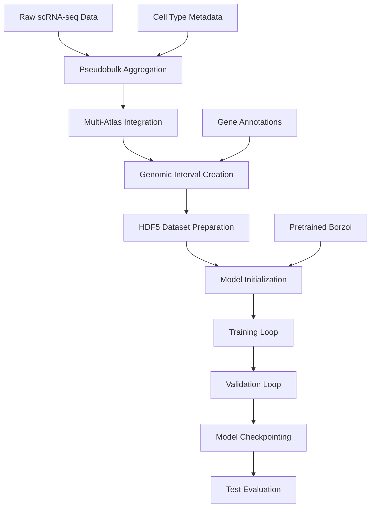

# Decima Training and Validation Workflow

## 1. OVERALL TRAINING ARCHITECTURE



## 2. DATA PREPARATION PIPELINE

### Stage 0-1: Data Collection and Integration

**Input Data Sources:**
- Brain Cell Atlas (BCA) - 11M cells
- Human Lung Cell Atlas (HLCA) - 2.4M cells  
- Human Retina Cell Atlas - 1.6M cells
- Skin Atopic Dermatitis Atlas - 600K cells
- Scimilarity Database - 24M cells
- Heart Atlas - 500K cells
- Zebrafish neural crest - 50K cells

**Pseudobulk Aggregation Strategy:**
```python
# Aggregation keys per atlas:
BCA: [sample_ID, cell_type, donor_ID, sample_status, treatment, region, subregion]
HLCA: [donor_id, ann_level_4, dataset, lung_condition, tissue]  
Retina: [cell_type, donor_id, sample_uuid, tissue, study_name]
Skin: [cell_type, donor_id, disease_status, treatment, region]
Heart: [sample_ID, region_finest, cell_state, cell_type]
```

**Quality Control:**
- Minimum 10 cells per pseudobulk
- Remove fetal, organoid, and cell line samples
- Filter out cancer and tumor samples
- Remove mislabeled cell types using expert curation

### Stage 2: ML-Ready Dataset Creation

**Genomic Interval Definition:**
- **Window size**: 524,288 bp (512kb)
- **Gene centering**: TSS-centered with configurable upstream/downstream
- **Filtering**: Remove high N-content regions (>40% Ns)
- **Gene mask**: 5th channel indicating target gene position

**Train/Validation/Test Splits:**
- Uses Borzoi genomic fold assignments
- **Genomic splitting**: Ensures no gene appears in multiple splits
- Prevents data leakage from genomic proximity
- **Split ratios**: ~80% train, ~10% val, ~10% test

## 3. MODEL ARCHITECTURE AND INITIALIZATION

### DecimaModel Architecture

**Base Architecture (from Borzoi):**
```
Input: [batch, 5, 524288]  # 4 DNA channels + 1 gene mask
    ↓
Stem: Conv1D(5 → 512, kernel=15)
    ↓
CNN Blocks (7x):
    - Conv1D(512 → 512, kernel=5)
    - BatchNorm + GELU activation
    - Residual connections
    ↓
Transformer Blocks (8x):
    - Multi-head attention (8 heads)
    - Feed-forward network
    - Layer normalization
    - Residual connections
    ↓
Output Head: Conv1D(1920 → num_tasks)
    ↓
Activation: torch.exp()  # For count prediction
```

**Initialization Options:**

1. **Pretrained (Default):**
   - Load human/mouse Borzoi weights from WandB
   - Modify input layer for 5-channel input (add gene mask channel)
   - Fine-tune on pseudobulk data

2. **Random Initialization:**
   - Xavier, Kaiming, or zeros initialization
   - Used as baseline comparisons

3. **Checkpoint Loading:**
   - Load existing Decima checkpoints
   - Resume training or transfer learning

### Key Architectural Innovations

**Gene Mask Channel:**
- 5th input channel indicating target gene location
- Enables gene-specific predictions from same sequence
- Allows multi-task learning across genes

**Sequence Length Adaptation:**
- Input: 524,288 bp sequences
- Cropped during training to 5,120 bp for efficiency
- Preserves long-range context while enabling batch training

## 4. TRAINING PROCESS

### LightningModel Training Framework

**Core Training Loop (lightning.py):**
```python
def training_step(self, batch, batch_idx):
    # Forward pass
    pred = self.model(batch['sequence'], batch['mask'])
    
    # Apply activation (exponential for counts)
    pred = torch.exp(pred)
    
    # Compute loss
    loss = self.loss_fn(pred, batch['target'])
    
    # Add temporal regularization (if enabled)
    if self.temporal_loss_fn:
        temporal_loss = self.temporal_loss_fn(pred, batch)
        loss += self.temporal_weight * temporal_loss
    
    # Log metrics
    self.log('train_loss', loss)
    return loss
```

**Loss Function (TaskWisePoissonMultinomialLoss):**
```python
# Combines two components:
# 1. Multinomial: Models relative expression across genes
# 2. Poisson: Models total expression count per sample

multinomial_loss = -torch.sum(targets * torch.log(pred / pred.sum(-1, keepdim=True)))
poisson_loss = torch.sum(pred) - torch.sum(targets * torch.log(pred))
total_loss = multinomial_loss + total_weight * poisson_loss
```

**Training Hyperparameters:**
- **Learning rate**: 3e-5 (with scheduler)
- **Weight decay**: 1e-4
- **Gradient clipping**: 5.0
- **Batch size**: Variable (depends on GPU memory)
- **Optimizer**: Adam
- **Precision**: Mixed (fp16)

### Multi-GPU Distributed Training

**Setup:**
```python
# PyTorch Lightning distributed training
trainer = pl.Trainer(
    accelerator='gpu',
    strategy='ddp',
    devices=8,  # Multi-GPU
    precision='16-mixed',
    gradient_clip_val=5.0
)
```

**Data Loading:**
- HDF5Dataset with lazy loading
- Distributed sampling across GPUs
- Sequence augmentation (shifts, no reverse complement)

## 5. VALIDATION STRATEGY

### Validation During Training

**Validation Loop:**
```python
def validation_step(self, batch, batch_idx):
    pred = torch.exp(self.model(batch['sequence'], batch['mask']))
    loss = self.loss_fn(pred, batch['target'])
    
    # Calculate per-gene correlations
    gene_corrs = []
    for i in range(pred.shape[-1]):
        corr = pearsonr(pred[:, i], batch['target'][:, i])
        gene_corrs.append(corr)
    
    self.log('val_loss', loss)
    self.log('val_gene_corr_mean', torch.mean(gene_corrs))
    return loss
```

**Validation Metrics:**
- **Loss**: TaskWisePoissonMultinomialLoss
- **Gene-level correlation**: Pearson correlation per gene
- **Sample-level correlation**: Correlation per sample across genes
- **Size factor correlation**: Controls for technical effects

### Cross-Validation Strategy

**Genomic Cross-Validation:**
- Uses Borzoi genomic folds (not random splits)
- Prevents overfitting to local genomic features
- More realistic evaluation of generalization

**Temporal Validation:**
- For temporal models, validate on future timepoints
- Tests model's ability to forecast expression changes

## 6. MODEL CHECKPOINTING AND EARLY STOPPING

### Checkpointing Strategy

**PyTorch Lightning Callbacks:**
```python
checkpoint_callback = ModelCheckpoint(
    monitor='val_gene_corr_mean',
    mode='max',
    save_top_k=3,
    filename='{epoch}-{val_gene_corr_mean:.4f}'
)
```

**Checkpoint Contents:**
- Model state dict
- Optimizer state
- Learning rate scheduler state
- Training metrics history
- Hyperparameters

### Early Stopping

**Criteria:**
- Monitor validation gene correlation
- Patience: 10 epochs without improvement
- Minimum delta: 0.001 improvement threshold

## 7. SPECIALIZED TRAINING VARIANTS

### Temporal Training (lightning_temporal.py)

**Joint Model Architecture:**
```python
class JointModel(nn.Module):
    def __init__(self):
        self.decima = DecimaModel()  # Static sequence model
        self.lstm = GeneTissueSpecificLSTM()  # Temporal component
        self.autoencoder = ExpressionAutoencoder()  # History encoding
        
    def forward(self, sequence, history, forecast_horizon):
        # Static prediction
        static_pred = self.decima(sequence)
        
        # Temporal prediction  
        history_encoded = self.autoencoder.encode(history)
        temporal_pred = self.lstm(history_encoded, forecast_horizon)
        
        # Combine predictions
        return static_pred + temporal_pred
```

**Temporal Loss Functions:**
- **Forecast loss**: MSE on future timepoints
- **Smoothness loss**: Encourages smooth temporal transitions
- **Cross-tissue consistency**: Consistency across cell types

### Disease-Specific Training

**Disease Loss Weighting:**
```python
class DiseaseLfcMSE(nn.Module):
    def forward(self, pred, target, disease_status):
        # Higher weight for disease vs healthy comparisons
        disease_mask = (disease_status == 'disease')
        healthy_mask = (disease_status == 'healthy')
        
        disease_loss = F.mse_loss(pred[disease_mask], target[disease_mask])
        healthy_loss = F.mse_loss(pred[healthy_mask], target[healthy_mask])
        
        return disease_loss + 0.5 * healthy_loss
```

## 8. EVALUATION PIPELINE

### Post-Training Evaluation (Stage 4)

**Prediction Generation:**
```python
# Generate predictions for all test genes
predictions = []
for batch in test_dataloader:
    with torch.no_grad():
        pred = model(batch['sequence'], batch['mask'])
        predictions.append(pred.cpu().numpy())
```

**Performance Metrics:**
1. **Gene-level Pearson correlation**: How well each gene is predicted
2. **Track-level correlation**: Expression pattern similarity
3. **Size factor correlation**: Technical effect control
4. **Dataset-specific performance**: Separate analysis per atlas

**Statistical Analysis:**
- Correlation distributions across genes
- Performance vs gene expression level
- Performance vs cell type specificity
- Comparison with baseline models (Borzoi, random)

### Ensemble Evaluation

**Multi-Model Predictions:**
- Train 3-5 model replicates with different random seeds
- Average predictions across ensemble
- Calculate prediction uncertainty (standard deviation)

**Robustness Analysis:**
- Performance consistency across replicates
- Identification of stable vs unstable predictions
- Confidence intervals for performance metrics

## 9. EXPERIMENT TRACKING AND REPRODUCIBILITY

### WandB Integration

**Experiment Logging:**
```python
wandb.init(
    project='decima-finetuning',
    config={
        'learning_rate': 3e-5,
        'batch_size': 16,
        'model_init': 'pretrained_human',
        'loss_total_weight': 1e-4
    }
)
```

**Metrics Logged:**
- Training/validation loss curves
- Gene-level correlation distributions
- Learning rate schedules
- Gradient norms
- Model predictions on validation set

### Reproducibility Framework

**Seed Setting:**
```python
# Comprehensive random seed control
pl.seed_everything(42)
torch.backends.cudnn.deterministic = True
torch.backends.cudnn.benchmark = False
```

**Version Control:**
- Git commit hashes logged with experiments
- Environment snapshots (conda env export)
- Data version tracking
- Model checkpoint versioning

## 10. COMPUTATIONAL REQUIREMENTS

### Hardware Requirements

**Training:**
- **GPUs**: 8x A100 (40GB) for full training
- **Memory**: 256GB+ system RAM for data loading
- **Storage**: 2TB+ for datasets and checkpoints
- **Network**: High-speed interconnect for multi-GPU

**Inference:**
- **GPU**: Single A100 or V100 sufficient
- **Memory**: 32GB+ system RAM
- **Storage**: 100GB for model checkpoints

### Training Time Estimates

**Full Training:**
- **Dataset size**: ~100K pseudobulk samples, ~26K genes
- **Training time**: 2-3 days on 8x A100
- **Validation**: Every epoch (~2 hours)
- **Total time**: 1 week including evaluation

**Fine-tuning:**
- **From pretrained**: 12-24 hours
- **Architecture search**: 1-2 weeks
- **Hyperparameter tuning**: 3-5 days

This comprehensive training framework enables robust, scalable training of genomic sequence-to-expression models with proper validation, evaluation, and reproducibility controls.